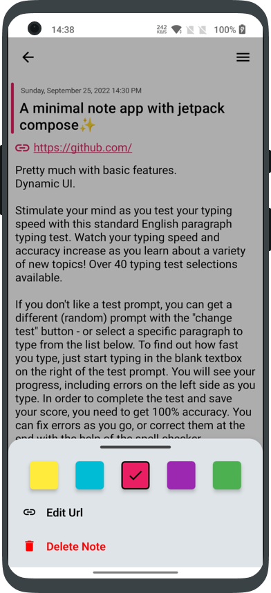
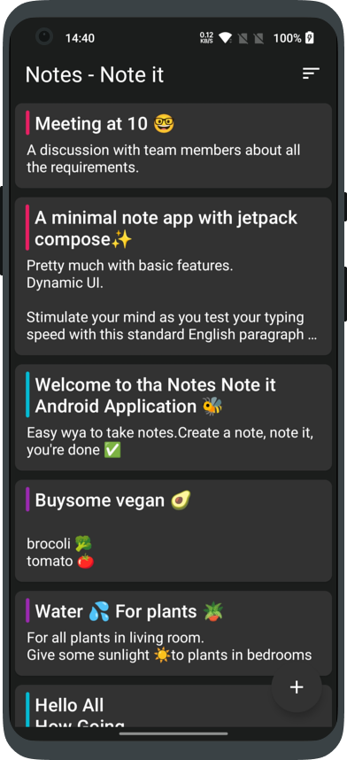

# Notes - Note it
✨**Notes - Note it** - 📝 App built to demonstrate the use of Modern Android development tools - Kotlin, Jetpack Compose, Coroutines, State Flow, Hilt-Dependency Injection, Navigation-Compose, MVVM, Room etc..  *Made with love ❤️ by [Ayyappan Karunan](https://github.com/ayyappankarunan)*

***Download & Try latest Notes - Note it app apk from below 👇***

## Built With 🛠
- [Kotlin](https://kotlinlang.org/) - First class and official programming language for Android development.
- [Coroutines](https://kotlinlang.org/docs/reference/coroutines-overview.html) - For asynchronous and more.
- [Jetpack Compose](https://developer.android.com/jetpack/compose) - Android’s modern toolkit for building native UI.
- [Navigation with Compose](https://developer.android.com/jetpack/compose/navigation) - The Navigation component provides support for Jetpack Compose applications.
- [Hilt](https://developer.android.com/training/dependency-injection/hilt-android) - Hilt is a dependency injection library for Android.
- [Android Architecture Components](https://developer.android.com/topic/libraries/architecture) - Collection of libraries that help you design robust, testable, and maintainable apps.
  - [Stateflow](https://developer.android.com/kotlin/flow/stateflow-and-sharedflow) - StateFlow is a state-holder observable flow that emits the current and new state updates to its collectors.
  - [Flow](https://kotlinlang.org/docs/reference/coroutines/flow.html) - A flow is an asynchronous version of a Sequence, a type of collection whose values are lazily produced.
  - [ViewModel](https://developer.android.com/topic/libraries/architecture/viewmodel) - Stores UI-related data that isn't destroyed on UI changes.
  - [Room](https://developer.android.com/topic/libraries/architecture/room) - SQLite object mapping library.

Screenshots
-----------

## Translating 🌍

Do you want to help Notes - Note it becoming international 🌍? We are more than happy!

To add a new translation just add a pull request with a new `strings.xml` file inside a `values-xx` folder (where `xx` is a [two-letter ISO 639-1 language code](https://en.wikipedia.org/wiki/ISO_639-1)).

## Contribute
If you want to contribute to this library, you're always welcome!
See [Contributing Guidelines](https://github.com/ayyappankarunan/Notes_Note_it/blob/master/CONTRIBUTION.md).

## License

[MIT License](LICENSE)